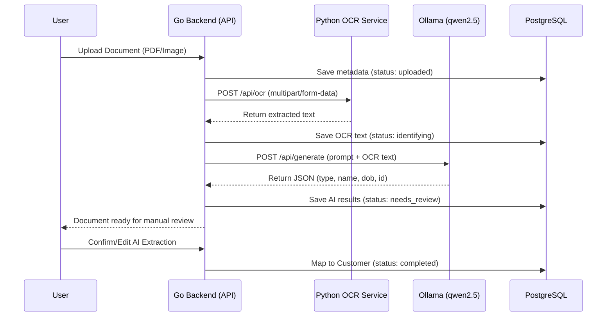

# DocuNest

DocuNest is a private, local-first document organization platform. It automatically scans, reads, classifies, and catalogs documents for individual customers without sending any sensitive data to external cloud services.

Designed for environments where document confidentiality is non-negotiable, DocuNest combines local OCR, on-device AI, and human-in-the-loop review to ensure reliable, zero-leakage records management.

---

## Core Capabilities

- **Local OCR**: Extracts text from PDFs and images locally using PyMuPDF and Tesseract. Very fast and lightweight (no heavy PyTorch models required).
- **On-Device AI Classification**: Communicates with local language models via Ollama to determine document categories (Aadhaar, PAN, Passport, Invoice, etc.) and extract customer names.
- **Human-in-the-Loop Review**: Enforces a "Needs Review" state where staff members verify AI extraction before files are committed to customer profiles.
- **Customer Dossiers & In-App Viewer**: Expandable profiles with a secure, embedded document viewer.
- **Data Wiper (Danger Zone)**: Fully authenticated, transactional hard-delete functionality to instantly erase a user's entire footprint (customers, documents, and disk files).

---

## Security & Privacy

DocuNest is built to strict security standards:
- **Authentication**: Argon2id password hashing, strict brute-force protection (IP lockout after 10 failed attempts), and secure HttpOnly cookies.
- **Upload Hardening**: File types are verified via binary MIME inspection. Files are stored using cryptographic UUIDs to prevent path traversal.
- **Multi-Tenant DB Isolation**: Strict `user_id` scoping across all PostgreSQL tables.
- **Audit Logging**: Every AI confirmation and manual file mapping is recorded.

---

## Architecture

1. **Frontend**: Single-page app built with Tailwind CSS and Alpine.js (zero build step).
2. **Core API Server (Go)**: Fast, low-memory engine managing sessions, file handling, DB orchestration, and asynchronous processing pipelines.
3. **OCR Engine (Python / FastAPI)**: Microservice executing PyMuPDF native extraction with Tesseract fallback for scanned images.
4. **Intelligence Layer (Ollama)**: Local LLM service returning structured JSON classifications using the **`qwen2.5`** model.
5. **Data Layer (PostgreSQL)**: Multi-tenant relational storage.

### System Flow Diagram



---

## Quick Start (Windows)

**Prerequisites**: 
- Go 1.21+
- Python 3.10+ 
- PostgreSQL (or Docker)
- Ollama (Ensure the `qwen2.5` model is pulled: `ollama pull qwen2.5`)
- Tesseract OCR (install via `winget install UB-Mannheim.TesseractOCR`)

**Exact Ready-to-Go Commands**:

1. Start your local PostgreSQL database via Docker:
   ```bash
   docker-compose up -d
   ```
2. Install the required Python OCR dependencies:
   ```bash
   cd ocr_service
   pip install -r requirements.txt
   cd ..
   ```
3. Pull the required AI model for Ollama:
   ```bash
   ollama pull qwen2.5
   ```
4. Run the master orchestrator script (starts the Go Backend and Python OCR service together):
   ```powershell
   .\start.ps1
   ```
5. Open your browser and navigate to `http://localhost:8080`. 
   - **Default Login**: `admin` / `admin` (You should change this in production!)

---

## API Overview

*All protected routes require an authenticated session cookie.*

- **Auth**: `POST /api/login`, `POST /api/logout`
- **Dashboard**: `GET /api/stats`, `POST /api/admin/wipe`
- **Customers**: `GET /api/customers`, `GET /api/customers/{id}/documents`
- **Documents**: `GET /api/documents`, `POST /api/documents/upload`
- **Processing**: `POST /api/documents/{id}/confirm`, `GET /api/documents/{id}/view`

---

## Production Deployment

1. **Secrets**: Generate a real `JWT_SECRET` (`openssl rand -base64 32`) and update the `.env` file.
2. **HTTPS**: Terminate TLS via a reverse proxy (Nginx/Caddy) to ensure the `Secure` flag on cookies works properly.
3. **Database SSL**: Set `DB_SSLMODE=require` in your `.env`.
4. **Network**: Keep Ollama and the Python OCR service bound strictly to `127.0.0.1` or isolated in a private Docker network.
